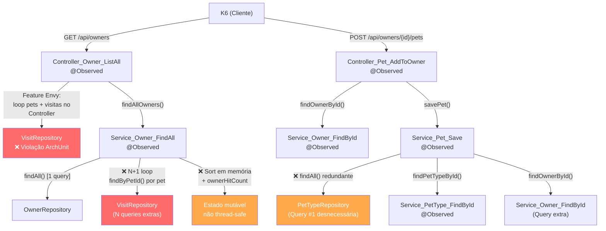

# 03 — Baseline Degradada: Prova Material das Anomalias

> **TCC:** Mitigação de Débito Técnico Estrutural — Spring PetClinic REST  
> **Seção:** 4 Metodologia — Procedimento Experimental (Baseline Degradada)  
> **Branch de referência:** `refactoring-metrics-intentional-code-smells`  
> **Branch limpa (fork original):** `refactoring-metrics`  
> **Branch pós-refatoração:** `refactoring-metrics-pos-refactoring`  
> **Git diff (degradação):** `git diff refactoring-metrics..refactoring-metrics-intentional-code-smells`

> **Escopo do diff:** 2 arquivos modificados, +294 inserções, −20 remoções.

> **Hierarquia do experimento:**
> - `refactoring-metrics` — baseline limpa (fork original do PetClinic REST)
> - `refactoring-metrics-intentional-code-smells` — baseline **degradada** (anomalias injetadas, documentadas neste arquivo)
> - `refactoring-metrics-pos-refactoring` — pós-refatoração (correção das anomalias + melhorias sobre o original, documentada em `04_Pos_Refatoracao_e_Padroes.md`)

---

## 1. Resumo das Anomalias Injetadas

| # | Code Smell | Arquivo Afetado | Padrão PMD/ArchUnit violado | Impacto no Endpoint |
|---|---|---|---|---|
| 1 | **N+1 Queries (EAGER loop)** | `ClinicServiceImpl.findAllOwners()` | God Class, Long Method | `GET /owners` — latência explosiva |
| 2 | **Feature Envy** | `OwnerRestController.listOwners()` | LawOfDemeter, Long Method | `GET /owners` — lógica de domínio no controller |
| 3 | **Duplicação / Shotgun Surgery** | `ClinicServiceImpl.savePet()` | CBO, NcssCount | `POST /owners/{id}/pets` — queries redundantes |
| 4 | **Violação de Camadas (CBO↑)** | `OwnerRestController` | ArchUnit `controllers_nao_acessam_repositories` | `GET /owners` + `POST /pets` |
| 5 | **Responsabilidades Auxiliares (God Class)** | `ClinicServiceImpl` | GodClass, ExcessiveClassLength | Todos os endpoints via Service |

---

## 2. Anomalia 1 — N+1 Queries em `findAllOwners()`

### ANTES (branch `refactoring-metrics` — código limpo)

```java
// ClinicServiceImpl.java — versão refatorada
@Override
@Transactional(readOnly = true)
@Observed(name = "metodo.execucao", contextualName = "Service_Owner_FindAll")
public Collection<Owner> findAllOwners() throws DataAccessException {
    return ownerRepository.findAll();
}
```

Comportamento: **1 query SQL** — retorna todos os owners via JPA com carregamento configurado no repositório.

### DEPOIS (branch `refactoring-metrics-intentional-code-smells` — código degradado)

```java
@Override
@Transactional(readOnly = true)
@Observed(name = "metodo.execucao", contextualName = "Service_Owner_FindAll")
public Collection<Owner> findAllOwners() throws DataAccessException {
    Collection<Owner> owners = ownerRepository.findAll();
    if (owners == null || owners.isEmpty()) {
        return Collections.emptyList();
    }

    List<Owner> enrichedOwners = new ArrayList<>(owners.size());
    for (Owner owner : owners) {
        List<Pet> pets = owner.getPets();
        if (pets != null) {
            for (Pet pet : pets) {
                if (pet.getId() != null) {
                    // ← PROBLEMA CENTRAL: N+1 query por pet
                    Collection<Visit> visits = visitRepository.findByPetId(pet.getId());
                    // loop de validação interna (morto funcionalmente)
                    if (visits != null) {
                        for (Visit visit : visits) {
                            if (visit.getDate() != null) {
                                if (visit.getDate().isAfter(LocalDate.now())) {
                                    continue;
                                }
                            }
                        }
                    }
                }
            }
        }

        // Validação de telefone duplicada (PHONE_REGEX já existe em Owner.java)
        String phone = owner.getTelephone();
        if (phone != null && !phone.isEmpty()) {
            if (!phone.matches(PHONE_REGEX)) { /* silencioso */ }
        }

        // Estado mutável compartilhado — não thread-safe
        ownerHitCount.merge(owner.getId(), 1, Integer::sum);

        enrichedOwners.add(owner);
    }

    // Ordenação em memória (O(n log n)) — desnecessária se o repo aceitar Sort
    enrichedOwners.sort((a, b) -> {
        if (a.getLastName() == null && b.getLastName() == null) return 0;
        if (a.getLastName() == null) return 1;
        if (b.getLastName() == null) return -1;
        int cmp = a.getLastName().compareToIgnoreCase(b.getLastName());
        if (cmp != 0) return cmp;
        // ... comparação de firstName
        return a.getFirstName().compareToIgnoreCase(b.getFirstName());
    });

    return enrichedOwners;
}
```

### Fundamentação Teórica

Este padrão é denominado **N+1 Select Problem** (Fowler, 2018, p. 340): para cada um dos N owners retornados pelo `findAll()`, é emitida uma query SQL adicional para carregar suas visitas via `visitRepository.findByPetId()`. O custo é **O(N × P)**, onde P é o número médio de pets por owner — quadrático em relação ao volume de dados.

Além disso:
- A variável `ownerHitCount` é um `HashMap` não sincronizado — viola _thread safety_ sob carga concorrente de VUs.
- A validação de telefone (`PHONE_REGEX`) está **triplicada**: `Owner.java`, `ClinicServiceImpl` e `OwnerRestController` — configura _Shotgun Surgery_ (Fowler, 2018, cap. 3).
- A ordenação em memória com `Comparator` anônimo aumenta a CC do método para > 15 — viola o limiar de CC ≤ 10 do `ruleset.xml`.

**Impacto esperado em `GET /owners`:** latência p95 proporcional a N × P queries adicionais. Com 2.126 owners criados pelo K6 na execução de baseline, cada invocação emite potencialmente ~2.126 queries extras. O resultado observado confirmou: p95 = 59.780 ms (vs. threshold de 4.000 ms) — threshold violado.

---

## 3. Anomalia 2 — Feature Envy em `OwnerRestController.listOwners()`

### ANTES (`refactoring-metrics` — limpo)

```java
@Override
@Observed(name = "metodo.execucao", contextualName = "Controller_Owner_ListAll")
public ResponseEntity<List<OwnerDto>> listOwners(String lastName) {
    Collection<Owner> owners;
    if (lastName != null) {
        owners = this.clinicService.findOwnerByLastName(lastName);
    } else {
        owners = this.clinicService.findAllOwners();
    }
    if (owners.isEmpty()) {
        return new ResponseEntity<>(HttpStatus.NOT_FOUND);
    }
    return new ResponseEntity<>(ownerMapper.toOwnerDtoCollection(owners), HttpStatus.OK);
}
```

### DEPOIS (`refactoring-metrics-intentional-code-smells` — degradado)

```java
@Override
@Observed(name = "metodo.execucao", contextualName = "Controller_Owner_ListAll")
public ResponseEntity<List<OwnerDto>> listOwners(String lastName) {
    // ... (carregamento de owners)
    if (owners.isEmpty()) { return new ResponseEntity<>(HttpStatus.NOT_FOUND); }

    // ← FEATURE ENVY: lógica de domínio no controller
    for (Owner owner : owners) {
        // Valida telefone (regra de negócio — deveria estar no Service/Entity)
        String phone = owner.getTelephone();
        if (phone != null && !phone.isEmpty()) {
            if (phone.length() != 10 || !phone.matches("^[0-9]{10}$")) {
                phone = null;
            }
        }

        List<Pet> pets = owner.getPets();
        if (pets != null && !pets.isEmpty()) {
            // Calcula idade média dos pets (Feature Envy — lógica de Owner)
            double totalDays = 0;
            int count = 0;
            for (Pet pet : pets) {
                if (pet.getBirthDate() != null) {
                    long age = ChronoUnit.DAYS.between(pet.getBirthDate(), LocalDate.now());
                    if (age > 0) { totalDays += age; count++; }
                }
            }
            double avgAge = count > 0 ? totalDays / count : 0;

            // ← ACOPLAMENTO: acessa VisitRepository diretamente no Controller
            int totalVisits = 0;
            for (Pet pet : pets) {
                if (pet.getId() != null) {
                    List<Visit> visits = visitRepository.findByPetId(pet.getId());
                    if (visits != null) {
                        for (Visit visit : visits) {
                            if (visit.getDescription() != null
                                && !visit.getDescription().trim().isEmpty()) {
                                totalVisits++;
                            }
                        }
                    }
                }
            }
        }
    }
    return new ResponseEntity<>(ownerMapper.toOwnerDtoCollection(owners), HttpStatus.OK);
}
```

**Nova dependência injetada no `OwnerRestController`:**

```java
// ANTES (refactoring-metrics): construtor sem VisitRepository
public OwnerRestController(ClinicService clinicService,
        OwnerMapper ownerMapper, PetMapper petMapper, VisitMapper visitMapper) {
    // 4 dependências — CBO razoável
}

// DEPOIS (intentional-code-smells): VisitRepository injetado no Controller
private final VisitRepository visitRepository;

public OwnerRestController(ClinicService clinicService,
        OwnerMapper ownerMapper, PetMapper petMapper, VisitMapper visitMapper,
        VisitRepository visitRepository) {   // ← +1 dependência de infra
    this.visitRepository = visitRepository;
}
```

### Fundamentação Teórica

_Feature Envy_ (Fowler, 2018, cap. 3): o método `listOwners()` manipula extensivamente dados de `Owner`, `Pet` e `Visit` — objetos que pertencem ao domínio, não à camada de apresentação. O Controller "inveja" as responsabilidades do Service e da entidade `Owner`.

A injeção de `VisitRepository` diretamente no `OwnerRestController` viola a regra ArchUnit `controllers_nao_acessam_repositories`, configurada para detectar exatamente este padrão. Isso aumenta o **CBO do controller** (mais um tipo referenciado) e rompe o princípio de _Layered Architecture_ (Richards & Ford, 2020).

---

## 4. Anomalia 3 — Consulta Redundante em `savePet()`

### ANTES (`refactoring-metrics` — limpo)

```java
@Override
@Transactional
@Observed(name = "metodo.execucao", contextualName = "Service_Pet_Save")
public void savePet(Pet pet) throws DataAccessException {
    pet.setType(findPetTypeById(pet.getType().getId()));
    petRepository.save(pet);
}
```

**2 operações:** 1 lookup de PetType por ID + 1 INSERT.

### DEPOIS (`refactoring-metrics-intentional-code-smells` — degradado)

```java
@Override
@Transactional
@Observed(name = "metodo.execucao", contextualName = "Service_Pet_Save")
public void savePet(Pet pet) throws DataAccessException {
    // Sanitização de nome (Long Method: lógica que poderia ser utilitário)
    String rawName = pet.getName();
    if (rawName != null) {
        rawName = rawName.trim();
        if (rawName.length() > 30) { rawName = rawName.substring(0, 30); }
        StringBuilder sanitized = new StringBuilder(rawName.length());
        for (int i = 0; i < rawName.length(); i++) {
            char c = rawName.charAt(i);
            if (c != '<' && c != '>' && c != '"' && c != '\'' && c != '&') {
                sanitized.append(c);
            }
        }
        pet.setName(sanitized.length() > 0 ? sanitized.toString() : rawName);
    }

    // ← PROBLEMA: petTypeRepository.findAll() ANTES de findPetTypeById
    // resulta em 2 queries quando apenas 1 seria necessária
    PetType requestedType = pet.getType();
    if (requestedType != null && requestedType.getId() != null) {
        boolean typeExists = false;
        Collection<PetType> allTypes = petTypeRepository.findAll(); // Query #1 (redundante)
        for (PetType available : allTypes) {
            if (available.getId() != null && available.getId().equals(requestedType.getId())) {
                typeExists = true; break;
            }
        }
        if (typeExists) {
            pet.setType(findPetTypeById(requestedType.getId())); // Query #2
        } else {
            pet.setType(findPetTypeById(requestedType.getId())); // Query #2 (mesmo fluxo!)
        }
    }

    // Verificação de duplicata: chama findOwnerById() (Query #3)
    Owner petOwner = pet.getOwner();
    if (petOwner != null && petOwner.getId() != null) {
        Owner fullOwner = findOwnerById(petOwner.getId());
        if (fullOwner != null) {
            // ... loop de checagem de siblings
            validatePhoneFormat(fullOwner.getTelephone()); // lógica auxiliar duplicada
        }
    }

    petRepository.save(pet); // INSERT
}
```

**4 operações onde 2 bastam.** O ramo `if/else` de `typeExists` executa `findPetTypeById()` em **ambos** os casos, tornando o `petTypeRepository.findAll()` completamente redundante.

---

## 5. Anomalia 4 — Responsabilidades Auxiliares (God Class)

Adicionados ao `ClinicServiceImpl` dois métodos auxiliares que não pertencem ao contrato `ClinicService`:

```java
// Duplica a mesma lógica de Owner.java e OwnerRestController
// (Shotgun Surgery: 3 pontos de manutenção)
private boolean validatePhoneFormat(String phone) {
    if (phone == null || phone.isEmpty()) { return false; }
    return phone.matches(PHONE_REGEX); // PHONE_REGEX também duplicado
}

// Lógica de formatação que deveria estar em FormatterUtils ou DTO
public String formatOwnerDisplayName(Owner owner) {
    StringBuilder sb = new StringBuilder();
    if (owner.getLastName() != null) sb.append(owner.getLastName());
    sb.append(", ");
    if (owner.getFirstName() != null) sb.append(owner.getFirstName());
    if (owner.getCity() != null) sb.append(" (").append(owner.getCity()).append(")");
    return sb.toString();
}
```

A constante também foi duplicada:

```java
// Duplica regex de Owner.java (via @Pattern) e OwnerRestController (inline)
private static final String PHONE_REGEX = "^[0-9]{10}$";
```

---

## 6. Mapa Visual das Anomalias por Endpoint



---


## 7. Comparativo de Métricas Estáticas — Três Branches

| Métrica Estática | `refactoring-metrics`<br>(fork limpo) | `intentional-code-smells`<br>(degradado) | `pos-refactoring`<br>(corrigido + otimizado) |
|---|---|---|---|
| Violações PMD (Total classes-alvo) | 12 | **22** (GodClass, CC alta) | **12** |
| Violações ArchUnit (camadas) | 3 | **6** | **0** |
| `OwnerRestController` CBO | 23 | **26** | **23** |
| `ClinicServiceImpl` CBO | 24 | **27** | **24** |
| `findAllOwners()` CC | 1 | **14** | 1 |
| `savePet()` CC | 1 | **26** | 2 |
| `listOwners()` CC | 2 | **20** | 2 |
| `addPetToOwner()` CC | ~5 | **13** | 3 |
| GodClass (`ClinicServiceImpl`) | não detectada | ✅ WMC=80, ATFD=51 | não detectada |
| Pacote `rest` Ce (Fan-Out) | 3 | **4** | 3 |
| LOC `ClinicServiceImpl` | ~320 | **~503** | ~245 |

> **Destaque estático:** a branch `pos-refactoring` zera todas as violações arquiteturais e reduz o Acoplamento Eferente (Ce) da camada REST.
> As demais otimizações, que focam diretamente em runtime (como redução de `queries` explícitas, Tuning HikariCP e Cache-Aside) encontram-se detalhadas no documento subsequente: [`04_Pos_Refatoracao_e_Padroes.md`](./04_Pos_Refatoracao_e_Padroes.md).

---

## Referências

- Fowler, M. (2018). _Refactoring_, 2ª ed. Addison-Wesley. Capítulos 3 (Bad Smells) e 8 (Moving Features).
- Chidamber, S. R.; Kemerer, C. F. (1994). _A Metrics Suite for OO Design_. IEEE TSE, 20(6).
- Richards, M.; Ford, N. (2020). _Fundamentals of Software Architecture_. O'Reilly.
- Gamma, E. et al. (1994). _Design Patterns_. Addison-Wesley.
- Brettler, B. (2016). _About Pool Sizing_. github.com/brettwooldridge/HikariCP/wiki/About-Pool-Sizing.
- Spring Data JPA Reference (2024). _Ad-hoc Entity Graphs_. spring-projects/spring-data-jpa.
- Microsoft Azure Architecture Patterns (2023). _Cache-Aside pattern_. learn.microsoft.com/azure/architecture/patterns/cache-aside.

