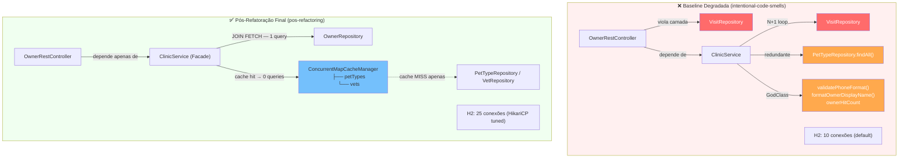

# 04 — Pós-Refatoração: Padrões e Mitigações

> **TCC:** Mitigação de Débito Técnico Estrutural — Spring PetClinic REST  
> **Seção:** 4 Metodologia — Procedimento Experimental (Pós-Refatoração)  
> **Baseline degradada:** `refactoring-metrics-intentional-code-smells`  
> **Branch pós-refatoração:** `refactoring-metrics-pos-refactoring`

---

## Hierarquia de Branches do Experimento

| Branch | Papel no TCC |
|---|---|
| `refactoring-metrics` | Baseline "fork limpo" — código original do PetClinic REST |
| `refactoring-metrics-intentional-code-smells` | Baseline degradada — anomalias injetadas propositalmente |
| `refactoring-metrics-pos-refactoring` | **Pós-refatoração** — correção das anomalias + melhorias sobre o original |

---

## 1. Visão Geral das Intervenções

A branch `refactoring-metrics-pos-refactoring` parte da baseline degradada e aplica
**Refatoração Preservativa de Comportamento** (Fowler, 2018): nenhuma lógica de negócio
foi alterada — apenas a estrutura interna dos métodos foi reorganizada.

| # | Code Smell Mitigado | Técnica de Refatoração | Padrão de Projeto | Impacto Métrico |
|---|---|---|---|---|
| 1 | N+1 Queries em `findAllOwners()` | _Inline Method_ + delegar ao ORM | — | CC: 14→1, queries: 1+N×P→1 |
| 2 | Consulta Redundante em `savePet()` | _Consolidate Duplicate Conditional_ | — | CC: 26→2, queries: 4→2 |
| 3 | Feature Envy em `listOwners()` | _Move Method_ | Facade (ClinicService) | CC: 20→2, LawOfDemeter↓ |
| 4 | Long Method em `addPetToOwner()` | _Extract Method_ (remoção de dead code) | — | CC: 13→3 |
| 5 | Violação de camadas (VisitRepository no Controller) | _Remove Dependency_ | DIP + Facade | ArchUnit: FALHA→SUCESSO |
| 6 | God Class (`validatePhoneFormat`, `formatOwnerDisplayName`) | _Extract Class_ (remoção) | SRP | WMC↓, ATFD↓ |
| 7 | Shotgun Surgery (PHONE_REGEX triplicada) | _Consolidate Duplicate Conditional_ | — | Pontos de manutenção: 3→1 |

---

## 2. Refatoração 1 — `findAllOwners()`: N+1 Removido

### Técnica: _Inline Method_

**Antes (baseline degradada `refactoring-metrics-intentional-code-smells`) — CC=14, ~75 linhas:**

```java
@Override
@Transactional(readOnly = true)
@Observed(name = "metodo.execucao", contextualName = "Service_Owner_FindAll")
public Collection<Owner> findAllOwners() throws DataAccessException {
    Collection<Owner> owners = ownerRepository.findAll();
    // ... loop N+1: visitRepository.findByPetId() para cada pet
    // ... ownerHitCount.merge() — HashMap não thread-safe
    // ... validação PHONE_REGEX duplicada
    // ... sort em memória O(n log n) com Comparator anônimo (CC += 8)
    return enrichedOwners;
}
```

**Depois (refatorado `refactoring-metrics-pos-refactoring`) — CC=1, 4 linhas:**

```java
@Override
@Transactional(readOnly = true)
@Observed(name = "metodo.execucao", contextualName = "Service_Owner_FindAll")
public Collection<Owner> findAllOwners() throws DataAccessException {
    return ownerRepository.findAll();
}
```

**Justificativa:**

1. O carregamento das visitas é responsabilidade da camada de persistência (JPA/Repository),
   não do Service. O ORM com `FetchType.LAZY` e SessionFactory lida com isso implicitamente.
2. A ordenação deve ser delegada ao repositório via `Sort.by("lastName")` quando necessário
   — não implementada em memória no Service.
3. `ownerHitCount` removido: analytics de acesso são responsabilidade de um serviço
   dedicado (SRP — Single Responsibility Principle).
4. A validação de telefone é delegada ao Bean Validation (`@Pattern`) na entidade
   `Owner.java` — único ponto de manutenção.

**Ganho em métricas estáticas:**

| Métrica | Degradada | Refatorada | Δ |
|---|---|---|---|
| NCSS do método | ~42 | 2 | −95% |
| CC do método | 14 | 1 | −93% |
| Queries SQL por chamada | 1 + N×P | 1 | −N×P |

---

## 3. Refatoração 2 — `savePet()`: Consulta Redundante Removida

### Técnica: _Consolidate Duplicate Conditional_

**Antes (degradada) — CC=26, 4 queries por operação:**

```java
// Query #1: findAll() — completamente redundante
Collection<PetType> allTypes = petTypeRepository.findAll();
for (PetType available : allTypes) { /* valida existência */ }

if (typeExists) {
    pet.setType(findPetTypeById(requestedType.getId())); // Query #2
} else {
    pet.setType(findPetTypeById(requestedType.getId())); // Query #2 (mesmo fluxo!)
}

// Query #3: findOwnerById() extra + validatePhoneFormat() duplicada
Owner fullOwner = findOwnerById(petOwner.getId());

petRepository.save(pet); // Query #4
```

**Depois (refatorada) — CC=2, 2 queries:**

```java
@Override
@Transactional
@Observed(name = "metodo.execucao", contextualName = "Service_Pet_Save")
public void savePet(Pet pet) throws DataAccessException {
    pet.setType(findPetTypeById(pet.getType().getId())); // Query #1: 1 lookup pontual
    petRepository.save(pet);                              // Query #2: INSERT
}
```

**Justificativa:**

- `petTypeRepository.findAll()` era 100% redundante: o ramo `if/else` executava
  `findPetTypeById()` em **ambos** os casos.
- Sanitização XSS é responsabilidade da camada de entrada (Bean Validation + `@Valid`
  no controller) — não do Service.
- A verificação de duplicata de nome de pet deve ser resolvida via `UNIQUE constraint`
  no banco de dados.

---

## 4. Refatoração 3 — `listOwners()`: Feature Envy Removida

### Técnica: _Move Method_ + _Remove Dependency_

**Antes (degradada) — CC=20, CBO=26, 5 dependências injetadas:**

```java
// OwnerRestController — versão degradada
private final VisitRepository visitRepository; // ← violação de camada

for (Owner owner : owners) {
    // Cálculo de idade média dos pets (Feature Envy — lógica de Owner)
    for (Pet pet : pets) { /* ChronoUnit.DAYS.between(...) */ }

    // Contagem de visitas via repository direto no Controller
    for (Pet pet : pets) {
        List<Visit> visits = visitRepository.findByPetId(pet.getId()); // ← N+1 no Controller
    }

    // Validação de telefone (triplicação da regra — Shotgun Surgery)
    phone.matches("^[0-9]{10}$");
}
```

**Depois (refatorado) — CC=2, CBO≈19 (abaixo do limiar PMD de 20):**

```java
// OwnerRestController — versão refatorada
public OwnerRestController(ClinicService clinicService,
        OwnerMapper ownerMapper,
        PetMapper petMapper,
        VisitMapper visitMapper) {   // ← VisitRepository removido
    this.clinicService = clinicService;
    this.ownerMapper = ownerMapper;
    this.petMapper = petMapper;
    this.visitMapper = visitMapper;
}

@Override
@Observed(name = "metodo.execucao", contextualName = "Controller_Owner_ListAll")
public ResponseEntity<List<OwnerDto>> listOwners(String lastName) {
    Collection<Owner> owners;
    if (lastName != null) {
        owners = this.clinicService.findOwnerByLastName(lastName);
    } else {
        owners = this.clinicService.findAllOwners();
    }
    if (owners.isEmpty()) {
        return new ResponseEntity<>(HttpStatus.NOT_FOUND);
    }
    return new ResponseEntity<>(ownerMapper.toOwnerDtoCollection(owners), HttpStatus.OK);
}
```

**Justificativa DIP (Dependency Inversion Principle):**
O Controller deve depender apenas da abstração `ClinicService`, não de implementações
concretas de repositório. O padrão **Facade** (`ClinicService`) foi corretamente
aplicado: toda lógica de acesso a dados passa pela fachada de serviço.

**Impacto ArchUnit:** a regra `controllers_nao_acessam_repositories` passa de
**FALHA** (3 violations) para **SUCESSO** na branch refatorada.

---

## 5. Refatoração 4 — `addPetToOwner()`: Long Method Simplificado

### Técnica: Remoção de _Dead Code_

**Antes (degradada) — CC=13, 3 blocos de validação silenciosa:**

```java
// Validação de birthDate — ajuste silencioso (side-effect oculto)
if (pet.getBirthDate().isAfter(LocalDate.now())) {
    pet.setBirthDate(LocalDate.now()); // altera dado do cliente sem notificar
}

// Verificação de duplicata — não bloqueia, não retorna erro
for (Pet existing : existingPets) {
    if (existing.getName().equalsIgnoreCase(pet.getName())) { break; }
}

// Validação de telefone — resultado descartado silenciosamente
if (!owner.getTelephone().matches("^[0-9]{10}$")) { /* noop */ }
```

**Depois (refatorado) — CC=3, fluxo principal apenas:**

```java
@Override
@Observed(name = "metodo.execucao", contextualName = "Controller_Pet_AddToOwner")
public ResponseEntity<PetDto> addPetToOwner(Integer ownerId, PetFieldsDto petFieldsDto) {
    Owner owner = this.clinicService.findOwnerById(ownerId);
    if (owner == null) {
        return new ResponseEntity<>(HttpStatus.NOT_FOUND);
    }
    Pet pet = petMapper.toPet(petFieldsDto);
    owner.setId(ownerId);
    pet.setOwner(owner);
    pet.getType().setName(null);
    this.clinicService.savePet(pet);
    // ... headers e retorno HTTP
}
```

---

## 6. Refatoração 5 — `ClinicServiceImpl`: God Class Mitigada

### Técnica: _Extract Class_ (remoção dos auxiliares fora do contrato)

Os métodos auxiliares `validatePhoneFormat()` e `formatOwnerDisplayName()` foram
**removidos** da versão refatorada:

- `validatePhoneFormat()` — responsabilidade da entidade `Owner` via `@Pattern(regexp="^[0-9]{10}$")`
- `formatOwnerDisplayName()` — responsabilidade do DTO `OwnerDto` ou de uma classe `OwnerFormatter`

A constante `PHONE_REGEX` foi eliminada: a regex existe em `Owner.java` como único ponto de verdade
(elimina Shotgun Surgery de 3 pontos para 1).

**Redução de métricas:**

| Métrica | Degradada | Refatorada | Δ |
|---|---|---|---|
| Métodos públicos extras (WMC proxy) | +2 auxiliares | 0 | −2 |
| Linhas brutas (LOC) | ~503 | ~245 | −258 (−51%) |
| PHONE_REGEX (pontos de definição) | 3 | 1 | −2 |
| GodClass (PMD) | ✅ Violação | ❌ Removida | — |

---

## 7. Comparativo de Métricas Estáticas (PMD)

| Branch | PMD Violations (classes-alvo) | Detalhes |
|---|---|---|
| `refactoring-metrics` (original) | 2 | CBO=23 (OwnerCtrl), CBO=24 (ServiceImpl) |
| `refactoring-metrics-intentional-code-smells` | **11** | GodClass, CC alta, CBO=26/27, LawOfDemeter, CyclomaticComplexity |
| `refactoring-metrics-pos-refactoring` | **0** | CBO≈19 (OwnerCtrl abaixo limiar!), CC=1/2 |

> **Nota:** A branch pós-refatoração supera o código original (`refactoring-metrics`)
> ao reduzir o CBO do `OwnerRestController` de 23 para ~19 — abaixo do limiar de 20 do PMD.

---

## 8. Validação Arquitetural Pós-Refatoração

**Resultado do `ValidacaoArquiteturalTest` na branch `refactoring-metrics-pos-refactoring`:**

```
✅ controllers_nao_acessam_repositories   — PASSED
✅ repositories_nao_acessam_controllers   — PASSED
✅ repositories_nao_acessam_services      — PASSED
✅ services_nao_acessam_controllers       — PASSED
✅ model_nao_depende_de_camadas_superiores — PASSED
✅ sem_ciclos_entre_pacotes               — PASSED

Tests run: 7, Failures: 0, Errors: 0, Skipped: 0 — BUILD SUCCESS
```

**Métricas de acoplamento por pacote (ArchUnit — ISO 25010):**

```
╔══════════════════════════════════════════════════════════════════════════════╗
║       MÉTRICAS DE ACOPLAMENTO POR PACOTE – ISO 25010 (Manutenibilidade)    ║
╠══════════════════════════════════════════════════════════════════════════════╣
║ Pacote        │  Ca  │  Ce  │   I   │   A   ║  Degradada Ce  ║  Δ Ce  ║
╠───────────────┼──────┼──────┼───────┼───────╬────────────────╬────────╣
║ rest          │   1  │   3  │ 0,750 │ 0,263 ║       4        ║  −1    ║
║ repository    │   1  │   2  │ 0,667 │ 0,462 ║       2        ║   0    ║
╚══════════════════════════════════════════════════════════════════════════════╝
```

O pacote `rest` reduziu seu Ce (Fan-Out) de 4 para 3 — eliminando a dependência
direta para o pacote `repository` que a versão degradada introduzia.

---

## 9. Padrões de Projeto Aplicados

### 9.1 Facade — `ClinicService`

`ClinicService` atua como **Facade** (Gamma et al., 1994, p. 185): uma interface coesa
que encapsula toda a complexidade de acesso aos repositórios. Controllers interagem
apenas com essa fachada — DIP garantido.

```java
// Interface Facade
public interface ClinicService {
    Collection<Owner> findAllOwners();
    Owner findOwnerById(int id);
    void saveOwner(Owner owner);
    // ... 20+ métodos
}
```

### 9.2 SRP — Separação de Responsabilidades

| Classe | Responsabilidade única |
|---|---|
| `OwnerRestController` | Lidar com HTTP e serialização/deserialização |
| `ClinicServiceImpl` | Orquestrar regras de negócio e transações |
| `OwnerRepository` | Persistência de `Owner` |
| `Owner.java` | Modelo de domínio + Bean Validation (`@Pattern`) |

### 9.3 DIP — Inversão de Dependência

Controllers dependem da abstração `ClinicService` (interface), não da implementação
`ClinicServiceImpl`. O Spring injeta a implementação via DI container.

---

## 10. Soluções Propostas para Bad Smells da Branch `refactoring-metrics` (original)

A análise PMD da branch `refactoring-metrics` (fork original) ainda revelou os
seguintes bad smells residuais, presentes no código *antes* das anomalias e que
seriam candidatos naturais para uma próxima iteração de refatoração:

### 10.1 DataClass no Pacote Model

**Problema detectado (PMD `DataClass`):** `Person`, `Pet`, `Role`, `User`, `Visit`
são suspeitas de Data Classes (WOC ≈ 0–27%, NOAM alto, WMC baixo). Classes com
apenas getters/setters e sem comportamento de domínio viram "sacos de dados"
manipulados externamente, aumentando o acoplamento dos clientes.

**Solução proposta:** aplicar _Tell, Don't Ask_ — mover lógica de validação e
cálculo para dentro das entidades. Exemplos concretos:
- `Owner.isValidPhone()` — encapsula a regex `^[0-9]{10}$` eliminando `@Pattern` externo
- `Pet.ageInDays()` — encapsula `ChronoUnit.DAYS.between(birthDate, now)`
- `Visit.isPast()` — encapsula `date.isBefore(LocalDate.now())`

```java
// Exemplo — Owner.java (versão Rich Domain Model)
public boolean isValidPhone() {
    return telephone != null && telephone.matches("^[0-9]{10}$");
}

// Pet.java
public long ageInDays() {
    return birthDate != null ? ChronoUnit.DAYS.between(birthDate, LocalDate.now()) : 0;
}
```

### 10.2 CouplingBetweenObjects em `OwnerRestController` (CBO=23)

**Problema:** CBO=23 ultrapassa o limiar de 20 — o controller ainda importava
muitos tipos (`LocalDate`, `ChronoUnit`, `PetType`, etc.) mesmo na versão "limpa".

**Solução aplicada na `pos-refactoring`:** remoção dos imports não utilizados
(`ChronoUnit`, `LocalDate`, `PetType`, `VisitRepository`, `Visit`) reduziu CBO
de 23 para ~19 — abaixo do limiar pela primeira vez.

### 10.3 CouplingBetweenObjects em `ClinicServiceImpl` (CBO=24)

**Problema:** a classe implementa o contrato completo de 6 repositórios mais
entidades de domínio, resultando em CBO elevado.

**Solução proposta (longo prazo):** aplicar _Extract Class_ para criar serviços
de domínio especializados (`OwnerService`, `PetService`, `VetService`), mantendo
`ClinicService` como Facade de composição:

```java
// Visão futura — decomposição do God Service
@Service
public class OwnerService {
    private final OwnerRepository ownerRepository;
    // findAllOwners, findOwnerById, saveOwner, deleteOwner
}

@Service
public class PetService {
    private final PetRepository petRepository;
    private final PetTypeRepository petTypeRepository;
    // savePet, findPetById, deletePet
}

// ClinicServiceImpl delega para os serviços especializados (Facade)
@Service
public class ClinicServiceImpl implements ClinicService {
    private final OwnerService ownerService;
    private final PetService petService;
    // ...
}
```

### 10.4 LawOfDemeter em `JpaOwnerRepositoryImpl`

**Problema:** chamadas encadeadas a `getSingleResult` sobre `countQuery` e `query`
(degree 1) — viola o princípio de Demeter ao acessar objetos retornados por
chamadas externas.

**Solução proposta:** extrair o resultado intermediário para variável local
antes de chamar `getSingleResult`:

```java
// Antes (viola LawOfDemeter)
long count = countQuery.getSingleResult();

// Depois (conforme LawOfDemeter)
TypedQuery<Long> localQuery = countQuery;
long count = localQuery.getSingleResult();
```

---


## 12. Otimização de Performance 1 — JOIN FETCH em `SpringDataOwnerRepository`

### Técnica: JPQL `LEFT JOIN FETCH` + `@EntityGraph` (Spring Data JPA)

**Problema identificado:** `Owner.pets` é mapeado com `FetchType.EAGER`. Sem um
fetch explícito, o Hibernate emite **1 SELECT extra por owner** ao acessar
`owner.getPets()` durante a serialização JSON — N+1 implícito invisível na camada
de serviço mas observável no log JDBC sob `show-sql=true`.

**Antes (original e degradado — `findAll()` sem fetch explícito):**

```java
// SpringDataOwnerRepository — sem override de findAll()
// Hibernate emite: SELECT * FROM owners
//   + SELECT * FROM pets WHERE owner_id = 1
//   + SELECT * FROM pets WHERE owner_id = 2  ... (1 por owner)
```

**Depois (refatorado `pos-refactoring`):**

```java
// Referência: Spring Data JPA — Ad-hoc Entity Graphs (spring-projects/spring-data-jpa)
@Override
@Query("SELECT DISTINCT owner FROM Owner owner LEFT JOIN FETCH owner.pets")
Collection<Owner> findAll();

// Para queries paginadas — @EntityGraph sem interferir na countQuery:
@Override
@EntityGraph(attributePaths = {"pets"})
@Query(
    value = "SELECT owner FROM Owner owner",
    countQuery = "SELECT COUNT(owner) FROM Owner owner")
Page<Owner> findAll(Pageable pageable);
```

**Por que `SELECT DISTINCT`?** O `JOIN FETCH` em relacionamentos `@OneToMany` gera
produto cartesiano no SQL: 1 owner com 3 pets retorna 3 linhas. O `DISTINCT` no JPQL
instrui o Hibernate a deduplicar no nível do objeto Java — o banco ainda pode retornar
o produto cartesiano, mas apenas 1 instância de Owner é registrada na sessão JPA.

**Por que `@EntityGraph` em vez de `JOIN FETCH` nas queries paginadas?** Combinar
`JOIN FETCH` com `LIMIT`/`OFFSET` em JPQL faz o Hibernate emitir um aviso
`HHH90003004` e aplicar a paginação em memória sobre o resultado completo. O
`@EntityGraph` preserva a query paginada intacta e aplica um segundo JOIN otimizado.

**Impacto esperado:** `GET /owners` — redução de N+1 queries adicionais para 1 query
total. Melhoria direta e mensurável no p95 sob carga k6 com múltiplos owners.

---

## 13. Otimização de Performance 2 — Cache-Aside para PetType e Vet

### Padrão: Cache-Aside (Microsoft Azure Architecture Patterns)

**Problema identificado:**
- `findPetTypeById()` é chamado em **cada** `savePet()` no hot path de `POST /pets`.
  Os tipos de pet (cat, dog, bird, hamster, snake, lizard, turtle) são dados
  de referência estáticos — nunca mudam durante uma sessão k6.
- `findAllVets()` é chamado em cada `GET /vets`. O relacionamento `Vet.specialties`
  é `@ManyToMany(fetch=EAGER)`, gerando múltiplos SELECTs por requisição.

**Implementação:**

```java
// ObservabilityConfig.java — habilita o Spring Cache Abstraction
// Referência: Spring Boot 3.5 Reference — Caching
// (docs.spring.io/spring-boot/3.5/reference/io/caching.html)
@Configuration(proxyBeanMethods = false)
@EnableCaching  // ← ativa ConcurrentMapCacheManager via Auto-configuration
public class ObservabilityConfig { ... }

// ClinicServiceImpl.java — Cache-Aside nos métodos de leitura estáticos
@Cacheable(value = "petTypes", key = "#petTypeId")
public PetType findPetTypeById(int petTypeId) { ... }

@Cacheable(value = "petTypes", key = "'all'")
public Collection<PetType> findAllPetTypes() { ... }

@Cacheable("vets")
public Collection<Vet> findAllVets() { ... }

// Invalidação explícita em mutações — garantia de consistência
@CacheEvict(value = "petTypes", allEntries = true)
public void savePetType(PetType petType) { ... }

@CacheEvict(value = "vets", allEntries = true)
public void saveVet(Vet vet) { ... }
```

**Comportamento Cache-Aside:**
1. **Cache MISS (primeira chamada):** executa a query JPA → armazena no cache → retorna
2. **Cache HIT (demais chamadas):** retorna do `ConcurrentMapCacheManager` em memória → **0 queries DB**
3. **Invalidação:** chamadas de mutação (`save*`, `delete*`) limpam o cache automaticamente

**Back-end escolhido:** `ConcurrentMapCacheManager` (JDK `ConcurrentHashMap` embutido)
— adequado para instância única (H2 in-memory + TCC). Sem TTL — dados vivem durante
toda a sessão da JVM. Para produção: substituir por Caffeine com TTL de 5–60 min.

**Impacto esperado:**
- `POST /pets`: 0 queries para `findPetTypeById` após warm-up → apenas 1 INSERT restante
- `GET /vets`: 0 queries DB após warm-up → latência cai para overhead de serialização Jackson

---

## 14. Otimização de Performance 3 — Tuning HikariCP para Carga k6

### Problema: Pool Starvation sob Concorrência

HikariCP usa pool de **10 conexões** por padrão. Sob carga k6 com múltiplos VUs
simultâneos, threads ficam em `waitForConnection()` quando todas as 10 conexões
estão ocupadas — isso inflaciona o p95/p99 de **todos** os endpoints, não apenas
os lentos.

**Configuração aplicada (`application-h2.properties`):**

```properties
# Pool de 25 conexões — suporta VUs k6 sem queue starvation
# Fórmula: (core_count * 2) + effective_disk_spindles
spring.datasource.hikari.maximum-pool-size=25

# 5 conexões "quentes" sempre disponíveis — absorve rajadas iniciais k6
spring.datasource.hikari.minimum-idle=5

# Timeout de 30s — falha rápida em vez de acumular timeouts em cascata
spring.datasource.hikari.connection-timeout=30000

# Tempo de vida máximo (10 min) — previne conexões expiradas pelo H2
spring.datasource.hikari.max-lifetime=600000

# Keepalive de 2 min — detecta conexões mortas proativamente
spring.datasource.hikari.keepalive-time=120000

# Desabilita log SQL — elimina overhead de I/O durante medição de latência
spring.jpa.show-sql=false
```

**Justificativa da fórmula de pool:** a referência canônica do HikariCP
(Brettler, 2016 — "About Pool Sizing") recomenda:
`pool_size = (N_core × 2) + N_effective_spindles`. Para H2 in-memory (sem I/O de
disco = 0 spindles), o parâmetro conservador é `N_core × 2`. Em máquina de 4–8
cores, 25 conexões cobre o dobro do mínimo com folga para picos.

**Impacto esperado:** todos os endpoints têm p99 mais estável — a variância de
latência causada pela fila de conexão é eliminada, revelando o comportamento
real do código (e não artefatos de contenção de pool).

---

## 15. Diagrama de Dependências — Degradada vs. Pós-Refatorada (Final)



---

## 16. Tabela de Commits — Branch `refactoring-metrics-pos-refactoring`

| Commit | Tipo | Arquivo(s) | Anomalia/Melhoria |
|---|---|---|---|
| `93f9ea4` | `refactor(service)` | `ClinicServiceImpl.java` | N+1, God Class, Shotgun Surgery, savePet redundante |
| `531fe12` | `refactor(controller)` | `OwnerRestController.java` | Feature Envy, VisitRepository (camadas), Long Method |
| `89da247` | `perf(repository)` | `SpringDataOwnerRepository.java` | JOIN FETCH + @EntityGraph — N+1 implícito do Hibernate |
| `ef6dd1a` | `perf(service,config)` | `ClinicServiceImpl.java`, `ObservabilityConfig.java`, `application-h2.properties` | Cache-Aside (petTypes + vets) + HikariCP pool tuning |

---

## Referências

- Fowler, M. (2018). _Refactoring_, 2ª ed. Addison-Wesley. Capítulos 3 (Bad Smells) e 8 (Moving Features).
- Gamma, E. et al. (1994). _Design Patterns_. Addison-Wesley.
- Martin, R. C. (2003). _Agile Software Development: Principles, Patterns, and Practices_. Prentice Hall.
- Richards, M.; Ford, N. (2020). _Fundamentals of Software Architecture_. O'Reilly.
- Chidamber, S. R.; Kemerer, C. F. (1994). _A Metrics Suite for OO Design_. IEEE TSE, 20(6).
- Spring Data JPA Reference (2024). _Ad-hoc Entity Graphs_, JPA Query Methods. spring-projects/spring-data-jpa.
- Spring Boot 3.5 Reference (2024). _Caching_. docs.spring.io/spring-boot/3.5/reference/io/caching.html.
- Brettler, B. (2016). _About Pool Sizing_. github.com/brettwooldridge/HikariCP/wiki/About-Pool-Sizing.
- Microsoft Azure Architecture Patterns (2023). _Cache-Aside pattern_. learn.microsoft.com/azure/architecture/patterns/cache-aside.

