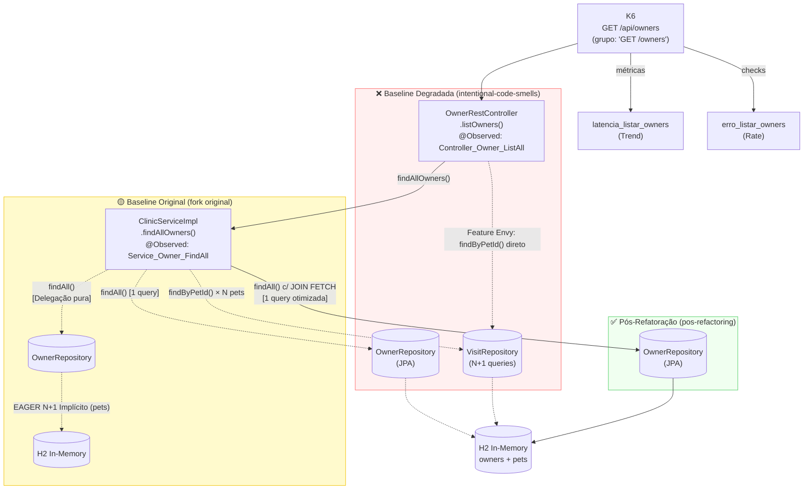
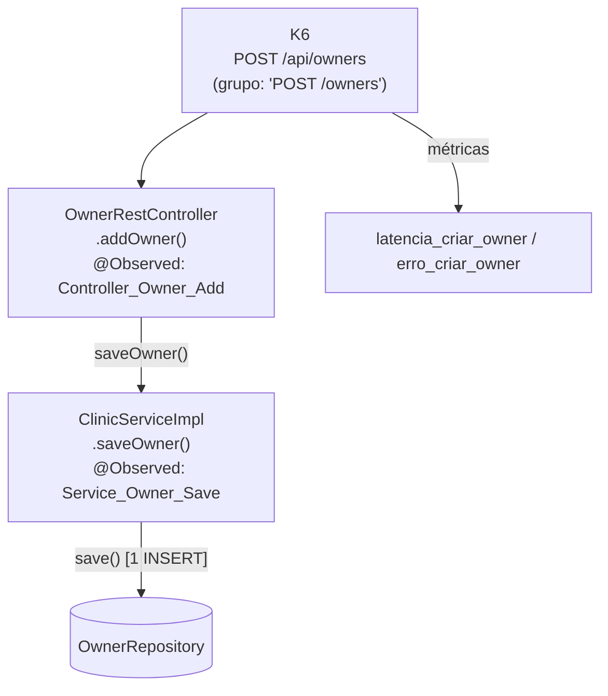
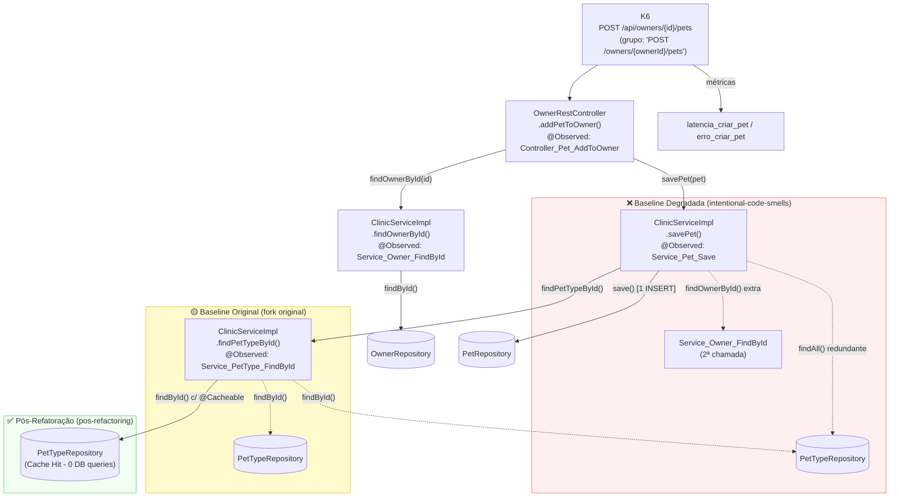
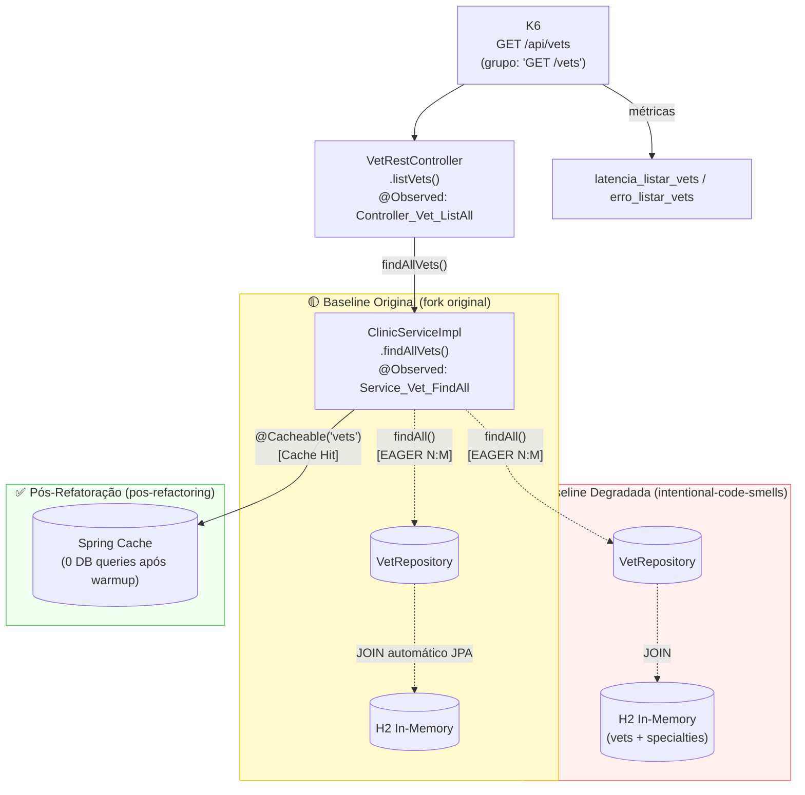
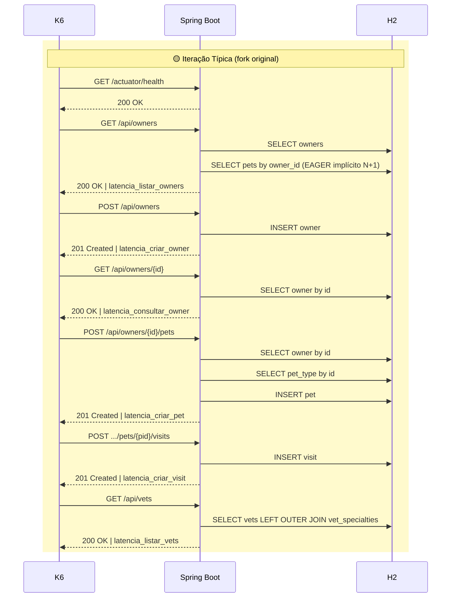
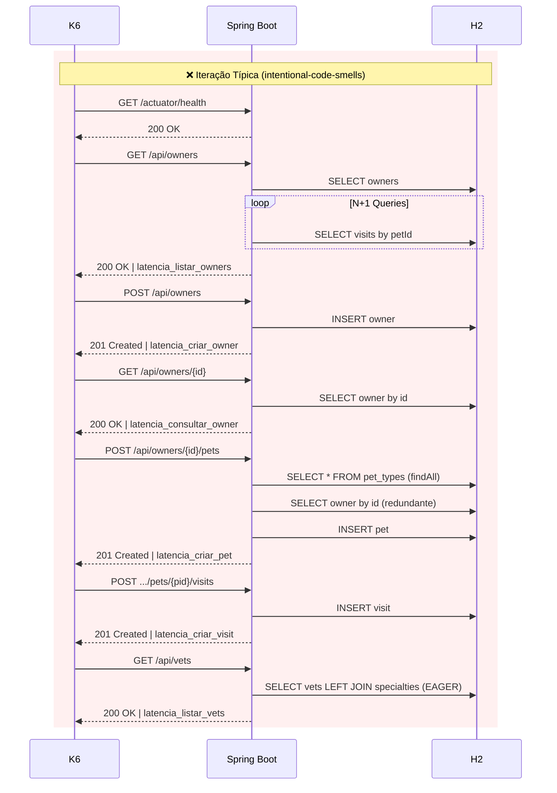
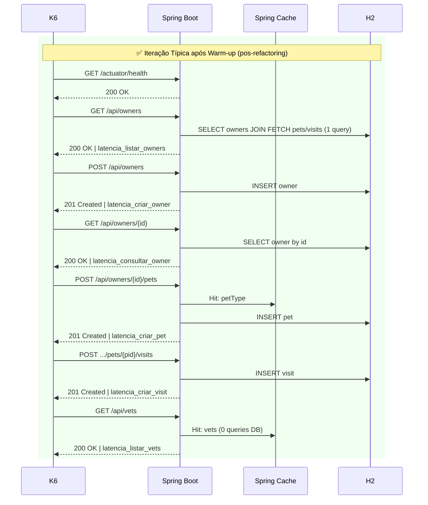
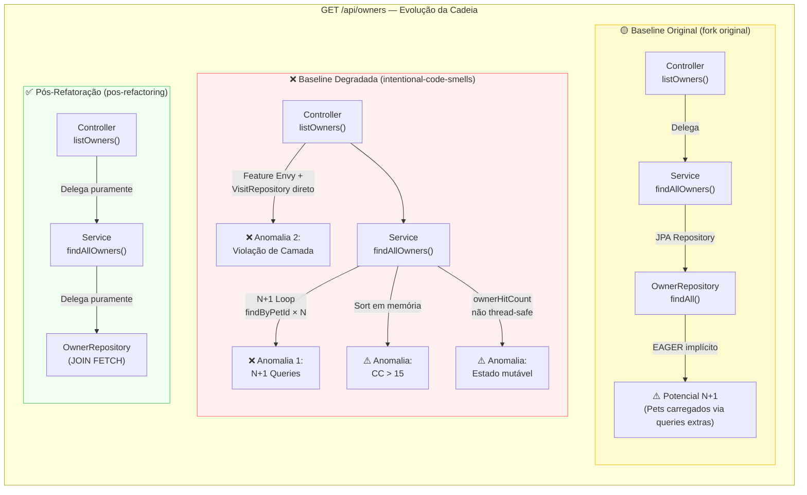
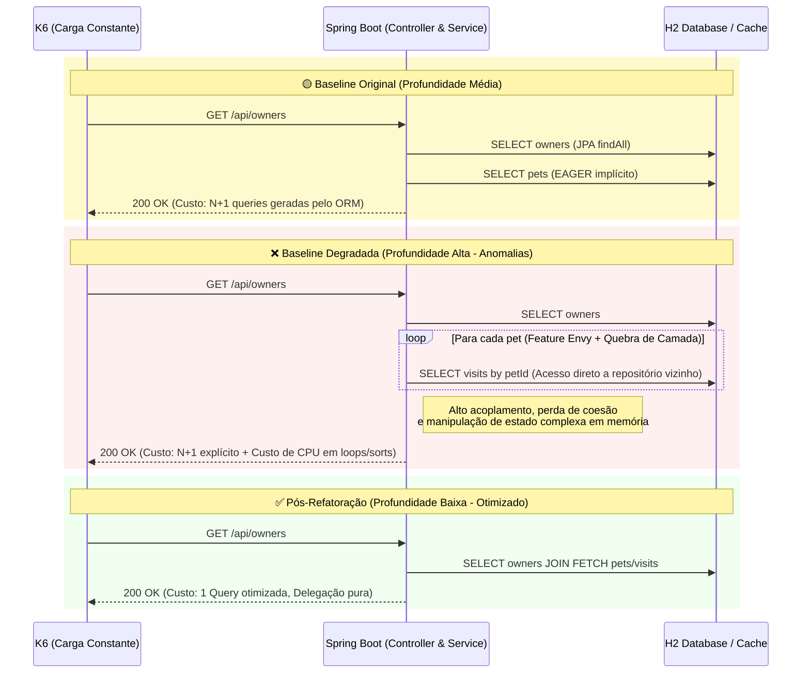

# 05 — Execução dos Testes e Relacionamentos

> **TCC:** Mitigação de Débito Técnico Estrutural — Spring PetClinic REST
> **Seção:** 4 Metodologia — Execução dos Testes

---

## 1. Infraestrutura de Execução

### 1.1 Topologia do Ambiente

```
Host (Linux — bare metal / VM)
├── Spring Boot (JVM — porta 9966)        ← API sob teste
│     └─ Tomcat embedded
│     └─ H2 in-memory (perfil: h2)
└── Docker Compose (infra/docker-compose.yml)
      ├── Prometheus (porta 9090)
      ├── Grafana    (porta 3000)
      └── K6         (--network host)
```

**Escolha do H2 in-memory:** isolamento total do estado do banco entre execuções (sem dados residuais de runs anteriores). A cada `run-benchmark.sh`, o banco é reiniciado junto com a JVM — garantindo reprodutibilidade.

### 1.2 Configuração da API (`api/docker-compose.yml`)

```yaml
services:
  petclinic-api:
    build:
      context: .
      dockerfile: Dockerfile
    ports:
      - "9966:9966"
    environment:
      SPRING_PROFILES_ACTIVE: "h2,spring-data-jpa"
      JAVA_TOOL_OPTIONS: >-
        -Xms512m -Xmx1g
        -XX:+UseG1GC
        -XX:MaxGCPauseMillis=200
```

**JVM flags:** G1GC com pausa máxima de 200 ms evita GC stalls que contaminariam as medições de latência.

### 1.3 Dockerfile — Build Determinístico

```dockerfile
FROM eclipse-temurin:17-jdk-alpine AS builder
WORKDIR /app
COPY .mvn/ .mvn/
COPY mvnw pom.xml ./
RUN ./mvnw dependency:go-offline -B
COPY src ./src
RUN ./mvnw package -DskipTests -B

FROM eclipse-temurin:17-jre-alpine
COPY --from=builder /app/target/*.jar app.jar
EXPOSE 9966
ENTRYPOINT ["java", "-jar", "app.jar"]
```

Multi-stage build: separa compilação (JDK) de execução (JRE), garantindo imagem final < 200 MB e build reprodutível.

---

## 2. Protocolo de Warm-up da JVM

A JVM HotSpot realiza compilação JIT incremental: os primeiros ~1000–5000 invocações de cada método são interpretados. Medir latência antes do JIT estar aquecido contamina os resultados com ruído de interpretação.

### 2.1 Fase de Warm-up no K6

```javascript
export const options = {
  scenarios: {
    // Fase 1: warm-up JVM (excluída dos thresholds e análise final)
    warmup: {
      executor: "ramping-vus",
      startVUs: 0,
      stages: [{ duration: "30s", target: 30 }],
      gracefulRampDown: "5s",
      tags: { phase: "warmup" }, // ← tag diferencia nos dados
    },

    // Fase 2: medições efetivas com carga constante
    steady_state: {
      executor: "constant-arrival-rate",
      startTime: "35s",  // Inicia rigorosamente após o warm-up
      rate: 26,          // Taxa nivelada pela branch mais lenta
      timeUnit: "1s",
      duration: "12m",
      preAllocatedVUs: 100,
      maxVUs: 300,
      tags: { phase: "test" }, // ← incluída nos thresholds
      gracefulStop: "10s",
    },
  },
};
```

**Duração total:** ~13 min por execução (35s warm-up + 12min steady_state + overhead).

### 2.2 Por que 30s de warm-up é suficiente?

- Com 30 VUs e endpoints simples (CRUD), os 30 segundos geram ~900 requisições.
- Métodos com CC baixo (como `saveOwner`) atingem o limiar de compilação JIT (~1000 invocações) dentro deste período.
- O `latencia_health` (`GET /actuator/health`) serve como proxy para monitorar quando a JVM estabiliza.

---

## 3. Protocolo de Múltiplas Execuções (N=5)

### 3.1 Script de Execução (`infra/scripts/run-benchmark.sh`)

```bash
# Uso:
bash infra/scripts/run-benchmark.sh baseline       # Fase 1
bash infra/scripts/run-benchmark.sh pos-refatoracao # Fase 2

# Fluxo interno por execução:
[1/5] docker compose down -v    # Limpa volumes Prometheus (estado zero)
[2/5] docker compose up -d      # Sobe Prometheus + Grafana
[3/5] ./mvnw spring-boot:run    # Inicia Spring Boot (aguarda /actuator/health)
[4/5] docker run k6 run \       # Executa K6
        --out csv=/results/k6-metrics-${LABEL}-${TIMESTAMP}.csv \
        /scripts/load-test.js
[5/5] docker compose down       # Derruba stack
```

### 3.2 Isolamento Entre Runs

Cada execução garante:

- **Banco zerado:** H2 em memória é recriado pela JVM a cada restart
- **Prometheus zerado:** `docker compose down -v` remove o volume de dados TSDB
- **Porta liberada:** script mata processos em 9966 antes de subir
- **Timestamp único:** evita sobreescrita de arquivos entre runs

---

## 4. Configuração de Carga e Virtual Users (VUs)

| Fase | Parâmetro K6 | Valor | Justificativa |
| --- | --- | --- | --- |
| **warm-up** | executor | `ramping-vus` | Escalonamento de 0 a 30 VUs é suficiente para acionar a compilação JIT gradualmente sem sobrecarga térmica precoce. |
| **steady_state** | executor | `constant-arrival-rate` | Taxa fixa garante isonomia de carga entre branches (a latência não freará os disparos). |
| **steady_state** | rate | `26` | Limite empírico de requisições por segundo da branch degradada; previne acúmulo irreal (`dropped_iterations`) por estrangulamento da ferramenta. |
| **steady_state** | maxVUs | `300` | Margem de segurança dimensionada pela regra $MaxVUs \ge Rate \times p99$, capaz de absorver surtos anômalos de até ~11s de latência. |

O modelo adotado substituiu antigas variações por *stages* ("spike") porque, num modelo *open-loop*, o pico de estresse natural se manifesta através do acúmulo automático de instâncias (VUs ativas) caso o sistema demonstre estrangulamento perante os rigorosos 26 acessos paralelos por segundo.

---

## 5. Diagramas de Relacionamento — Endpoint × Cadeia de Chamadas

### 5.1 GET /api/owners — Cadeia Completa



### 5.2 POST /api/owners — Cadeia Completa



### 5.3 POST /api/owners/{id}/pets — Cadeia Mais Profunda (4 spans)



### 5.4 GET /api/vets — Relação N:M EAGER



### 5.5 Fluxo Completo K6 — Iteração Baseline Original



### 5.6 Fluxo Completo K6 — Iteração na Baseline Degradada



### 5.7 Fluxo Completo K6 — Iteração Pós-Refatoração



---

## 6. Onde as Anomalias se Localizam na Cadeia




---

## 7. Síntese Comparativa do Impacto Estrutural

A comparação entre os cenários deve ser realizada considerando o mesmo endpoint, antes e após a introdução das anomalias arquiteturais, mantendo constantes o ambiente de execução, a carga de trabalho e os demais fatores experimentais. Dessa forma, busca-se isolar o impacto da degradação estrutural sobre as métricas de runtime.

O objetivo não é demonstrar que determinados endpoints são naturalmente mais lentos por acessarem banco de dados ou por executarem operações mais complexas, mas verificar se a degradação estrutural aumenta o custo de execução **desses mesmos fluxos** em comparação ao cenário original. A análise também deve considerar a magnitude da variação entre diferentes perfis de execução: caso endpoints com maior profundidade de chamadas, maior número de dependências ou maior interação com recursos externos apresentem degradação significativamente superior aos fluxos mais simples, isso constitui evidência de que o efeito depende do contexto de execução.

O mapeamento das anomalias introduzidas por módulo permite correlacionar características arquiteturais — como aumento do acoplamento e redução de coesão — com alterações nas métricas dinâmicas coletadas via Micrometer Observation. Embora essa abordagem não estabeleça causalidade absoluta, ela fornece evidências experimentais consistentes sobre a relação entre degradação estrutural e comportamento do sistema em tempo de execução. Mesmo que parte dos endpoints apresente pouca ou nenhuma alteração nas métricas de desempenho, esse resultado continua sendo cientificamente relevante, pois indica que os efeitos da degradação não são uniformes e dependem das características do fluxo executado.

### 7.1 Diferença de Profundidade no Fluxo (Exemplo: GET /owners)

O diagrama abaixo ilustra como a degradação altera a profundidade e a complexidade do fluxo de execução para uma mesma requisição K6, afetando o esforço computacional (CPU/Memória) e o número de interações com o banco de dados.



---

## Referências

- Grafana Labs. _K6 Scenarios Documentation_. https://grafana.com/docs/k6/latest/using-k6/scenarios/
- Beyer, B. et al. (2016). _Site Reliability Engineering_. O'Reilly.
- Mann, H. B.; Whitney, D. R. (1947). "On a Test of Whether One of Two Random Variables Is Stochastically Larger Than the Other". _The Annals of Mathematical Statistics_, 18(1), 50–60.
- Ford, N.; Parsons, R.; Kua, P. (2022). _Building Evolutionary Architectures_, 2ª ed. O'Reilly.
