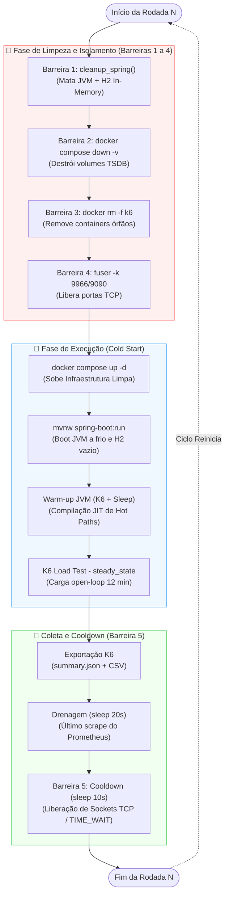

# 06 — Isolamento Ambiental e Reprodutibilidade do Experimento

> **TCC:** Mitigação de Débito Técnico Estrutural — Spring PetClinic REST
> **Seção:** 4 Metodologia — Garantias de Isolamento e Reprodutibilidade

---

## 1. Motivação

A orientadora levantou uma preocupação central (Seção 4, Rascunho TCC):

> *"Precisamos garantir que uma eventual diferença observada entre a versão original e a versão degradada esteja associada às anomalias introduzidas e não à variabilidade natural do ambiente de execução."*

Este documento formaliza as **cinco barreiras de isolamento** implementadas no orquestrador de benchmark (`infra/scripts/run-benchmark.sh`) e explica como cada uma elimina uma fonte específica de ruído experimental. O objetivo é demonstrar que o protocolo atende aos requisitos de reprodutibilidade exigidos por um estudo quantitativo com abordagem experimental (GIL, 2002).

---

## 2. Modelo de Ameaças à Validade Interna

Antes de descrever as barreiras, é necessário identificar as fontes de ruído que poderiam contaminar as medições de latência (p95/p99) e taxa de erros entre rodadas consecutivas:

| # | Ameaça | Fonte de Ruído | Impacto Potencial |
|---|--------|---------------|-------------------|
| A1 | Estado residual da JVM | Cache JIT, heap alocado, thread pool da rodada anterior | Rodada N+1 inicia "quente", com compilação JIT já feita — mascarando o custo real de warm-up e distorcendo p95 |
| A2 | Estado residual do banco | Dados criados pelo K6 na rodada anterior (owners, pets, visits) | Volume crescente de registros aumenta tempo de `findAll()` proporcionalmente — variável não controlada |
| A3 | Séries temporais Prometheus | Métricas TSDB da rodada anterior no volume Docker | Grafana e queries Prometheus mostram dados mesclados de múltiplas rodadas |
| A4 | Containers Docker órfãos | Container K6 ou infra de rodada anterior que não foi encerrado corretamente | Competição por CPU/memória e portas ocupadas — falha na inicialização |
| A5 | Portas TCP ocupadas | Processo Spring Boot ou Prometheus de rodada anterior ainda escutando | `bind: address already in use` — falha na inicialização |
| A6 | Conexões TCP em TIME_WAIT | Sockets da rodada anterior no kernel, ainda em estado de espera | Latência inflada nos primeiros segundos da rodada seguinte |

---

## 3. Barreiras de Isolamento — Implementação

### 3.1 Barreira 1 — Destruição completa da JVM (`cleanup_spring`)

```bash
cleanup_spring() {
  if [[ -n "$SPRING_PID" ]] && kill -0 "$SPRING_PID" 2>/dev/null; then
    kill "$SPRING_PID" 2>/dev/null || true
    wait "$SPRING_PID" 2>/dev/null || true
    SPRING_PID=""
  fi
}
```

**Ameaça mitigada:** A1 (estado JVM) + A2 (estado do banco).

**Mecanismo:** O processo Java é encerrado via `SIGTERM`, destruindo:
- O heap inteiro da JVM (objetos, caches, compilações JIT)
- O banco H2 in-memory (todo o schema + dados são voláteis)
- O pool de conexões JDBC do HikariCP
- As threads do Tomcat embedded

**Resultado:** A rodada seguinte inicia com uma JVM completamente fria — sem nenhum dado, cache ou compilação residual. Isso é equivalente a um "cold start" total, garantindo que cada rodada é independente.

### 3.2 Barreira 2 — Destruição de volumes Docker (`docker compose down -v`)

```bash
docker compose -f "$INFRA_COMPOSE" down -v --remove-orphans 2>/dev/null || true
```

**Ameaça mitigada:** A3 (séries Prometheus) + A4 (containers órfãos).

**Mecanismo:** O flag `-v` remove explicitamente os **named volumes** definidos no `docker-compose.yml`:
- `prometheus_data` — TSDB com séries temporais da rodada anterior
- `grafana_data` — dashboards e configurações de sessão
- `loki_data` — logs agregados

O flag `--remove-orphans` garante que containers de serviços removidos do compose (e.g., versões anteriores do K6) também sejam destruídos.

**Resultado:** Prometheus inicia com TSDB vazio — nenhuma série temporal da rodada anterior existe. Cada rodada possui um horizonte temporal isolado.

### 3.3 Barreira 3 — Remoção de containers K6 órfãos

```bash
k6_orphans=$(docker ps -q --filter "ancestor=grafana/k6:latest" 2>/dev/null || true)
if [[ -n "$k6_orphans" ]]; then
  docker rm -f $k6_orphans 2>/dev/null || true
fi
```

**Ameaça mitigada:** A4 (containers órfãos).

**Mecanismo:** Busca ativa por containers da imagem `grafana/k6:latest` que possam ter sobrevivido a um `Ctrl+C` ou falha anterior. O `docker rm -f` força a remoção imediata.

**Resultado:** Nenhum processo K6 concorrente compete por CPU/memória durante a rodada ativa.

### 3.4 Barreira 4 — Liberação forçada de portas (`fuser -k`)

```bash
# Porta 9966 — Spring Boot
if ss -tlnp 2>/dev/null | grep -q ':9966 '; then
  fuser -k 9966/tcp 2>/dev/null || true
  sleep 2
fi

# Porta 9090 — Prometheus
if ss -tlnp 2>/dev/null | grep -q ':9090 '; then
  fuser -k 9090/tcp 2>/dev/null || true
  sleep 1
fi
```

**Ameaça mitigada:** A5 (portas ocupadas).

**Mecanismo:** `ss -tlnp` verifica o estado real do socket no kernel (mais confiável que `lsof`). Se ocupado, `fuser -k` envia `SIGKILL` ao processo que detém a porta. O `sleep` subsequente aguarda a transição do socket de `CLOSE_WAIT` para `CLOSED`.

**Resultado:** As portas 9966 e 9090 estão garantidamente livres antes de iniciar Spring Boot e Prometheus.

### 3.5 Barreira 5 — Cooldown inter-rodadas (`COOLDOWN_BETWEEN_RUNS`)

```bash
COOLDOWN_BETWEEN_RUNS=10  # segundos

if [[ $RUN -lt $N_RUNS ]]; then
  sleep "$COOLDOWN_BETWEEN_RUNS"
fi
```

**Ameaça mitigada:** A6 (conexões TCP em TIME_WAIT).

**Mecanismo:** O protocolo TCP mantém sockets no estado `TIME_WAIT` por 2×MSL (Maximum Segment Lifetime), tipicamente 60s no Linux. Porém, como tanto Spring Boot quanto K6 usam `--network host` (sem NAT do Docker), o overhead de TIME_WAIT é reduzido. Os 10 segundos de cooldown garantem que:
- Todas as conexões HTTP do K6 → Spring Boot foram drenadas
- O garbage collector do SO liberou descritores de arquivo
- O kernel finalizou a contabilização de métricas de rede

**Resultado:** A rodada seguinte não herda latência inflada por sockets residuais.

---

## 4. Sequência Completa de Isolamento por Rodada

O diagrama abaixo ilustra a sequência temporal de uma rodada completa, destacando onde cada barreira atua:



---

## 5. Validação Experimental do Isolamento

Para confirmar que as barreiras são eficazes, os seguintes indicadores podem ser verificados após cada rodada:

| Verificação | Comando | Resultado Esperado |
|---|---|---|
| JVM anterior encerrada | `pgrep -f 'spring-boot:run'` | Nenhum processo encontrado |
| H2 zerado | Contagem de owners no início da rodada | Apenas seed data (10 owners) |
| Prometheus vazio | `curl localhost:9090/api/v1/query?query=up` | Apenas scrapes da rodada atual |
| Porta 9966 livre | `ss -tlnp \| grep :9966` | Vazio |
| Porta 9090 livre | `ss -tlnp \| grep :9090` | Vazio |
| Containers K6 | `docker ps --filter ancestor=grafana/k6` | Nenhum container listado |

---

## 6. Trap de Segurança — Cleanup em Caso de Falha

O script implementa um `trap EXIT` que garante limpeza mesmo em caso de erro inesperado (`Ctrl+C`, falha do Maven, crash do K6):

```bash
cleanup_all() {
  local exit_code=$?
  cleanup_spring
  docker compose -f "$INFRA_COMPOSE" down -v --remove-orphans 2>/dev/null || true
  docker rm -f $(docker ps -q --filter "ancestor=grafana/k6:latest") 2>/dev/null || true
  exit "$exit_code"
}
trap cleanup_all EXIT
```

**Garantia:** Independente de como o script termine (sucesso, erro, interrupção), o ambiente é restaurado ao estado limpo. Isso evita que uma rodada falhada contamine a próxima execução manual.

---

## 7. Limitações Conhecidas (Ameaças à Validade Externa)

As barreiras acima controlam as variáveis **internas** ao experimento. Contudo, existem fatores **externos** que não são controlados pelo script e devem ser documentados como limitações:

| Fator | Descrição | Mitigação Recomendada |
|---|---|---|
| Carga do host (CPU/RAM) | Processos do SO, IDE, browser competem por recursos | Fechar aplicações pesadas durante as 5 rodadas |
| Thermal throttling | CPUs modernas reduzem clock sob temperatura elevada | Monitorar `sensors` ou `lm-sensors` durante os testes |
| Variabilidade do scheduler | O escalonador do Linux não garante tempo de CPU determinístico | Repetição estatística (N=5) + cálculo de desvio padrão |
| Versão do kernel/drivers | Diferenças entre máquinas podem afetar I/O e rede | Documentar `uname -r` e `lscpu` no relatório |

A mitigação primária para todos esses fatores é a **repetição estatística** (N=5 rodadas por fase), combinada com o cálculo de média, desvio padrão e coeficiente de variação (CV%). Conforme indicado pela orientadora, resultados com CV% > 20% devem ser investigados e, potencialmente, as rodadas outliers descartadas com justificativa.

---

## 8. Alinhamento com a Metodologia do TCC

Este protocolo de isolamento responde diretamente aos requisitos metodológicos levantados no Rascunho do TCC (Seção 4):

| Requisito do TCC | Implementação |
|---|---|
| *"Repetição dos testes"* (Seção 4, item 4) | Loop de N=5 rodadas com `run-benchmark.sh baseline 5` |
| *"Aquecimento da JVM (warm-up)"* (Seção 4, item 4) | Cenário K6 `warmup` (30s, tag `phase:warmup`) + `WARMUP_EXTRA_SECS=15` |
| *"Influência do ambiente de execução"* (Orientadora) | 5 barreiras de isolamento documentadas neste arquivo |
| *"Diferença associada às anomalias e não à variabilidade"* (Orientadora) | Clean state completo + Isolamento TCP e volumes + Múltiplas repetições (N=5) |

---

## 9. Referências Internas

| Artefato | Caminho | Relação |
|---|---|---|
| Script orquestrador | `infra/scripts/run-benchmark.sh` | Implementa as 5 barreiras |
| Script de pós-processamento | `infra/scripts/post-process.py` | Consolida N runs + estatísticas |
| Teste de carga K6 | `infra/k6/load-test.js` | Define cenários warmup/steady_state |
| Composição Docker | `infra/docker-compose.yml` | Define volumes destruídos pela Barreira 2 |
| Warm-up JVM | `05_Execucao_Testes_e_Relacionamentos.md` §2 | Complementa a Barreira 1 |
| Variáveis e Métricas | `01_Variaveis_e_Metricas.md` | Define as variáveis dependentes medidas |
