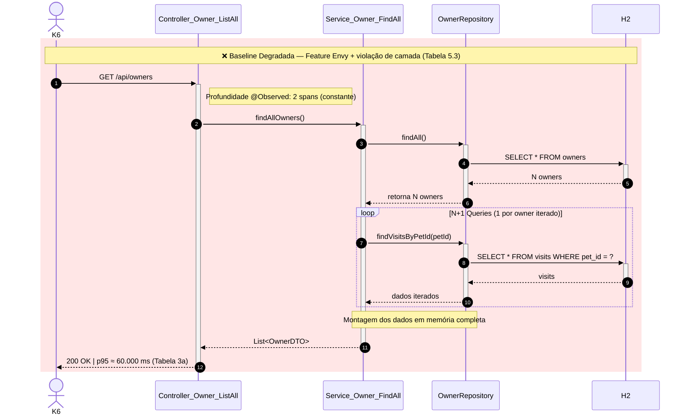
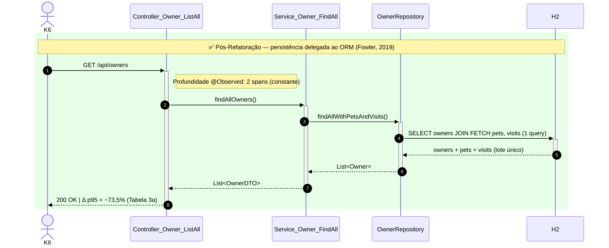
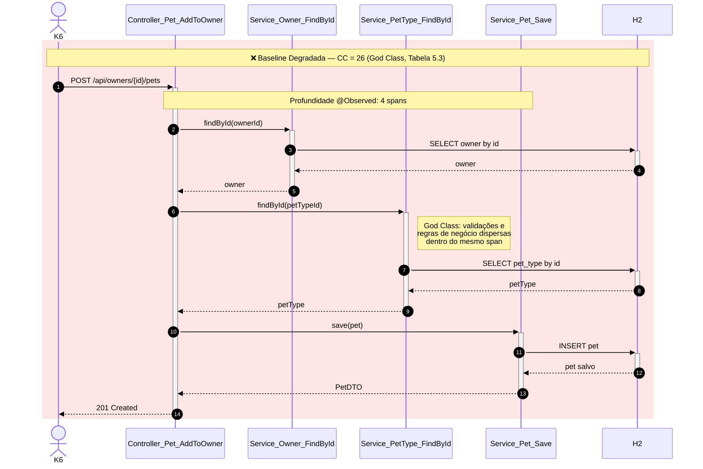
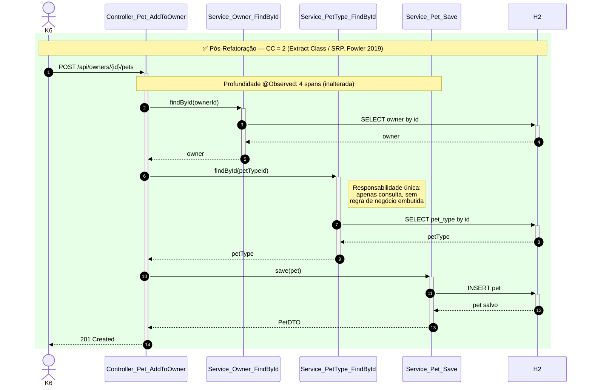

### 5.3.2. Diagrama de Fluxo — Gargalo N+1 em `GET /api/owners`

Os diagramas de sequência abaixo contrastam o caminho de execução de `GET /api/owners` nas duas
branches relevantes. Note que a **profundidade instrumentada (`@Observed`) permanece em 2 spans**
em ambos os casos (Controller → Service, Tabela 5.4) — a diferença crítica não está no número de
camadas atravessadas, mas no que acontece **dentro** da camada Service/Repository, invisível ao
Micrometer e só identificável pela análise estática (Feature Envy, Tabela 5.3) combinada ao
tracing de queries.

### 5.3.3. Diagrama de Fluxo — Profundidade Constante em `POST /api/owners/{id}/pets`

Este par de diagramas ilustra o achado contra-intuitivo discutido no texto: a cadeia de **4
spans** (a maior profundidade mapeada na Tabela 5.4) permanece estruturalmente idêntica entre
Baseline Degradada e Pós-Refatoração — mesmo com a Complexidade Ciclomática da classe
responsável caindo de CC = 26 para CC = 2 após a extração da God Class. A refatoração
"esvaziou" a complexidade interna de cada span, sem eliminar ou colapsar nenhuma camada do
caminho de execução.

